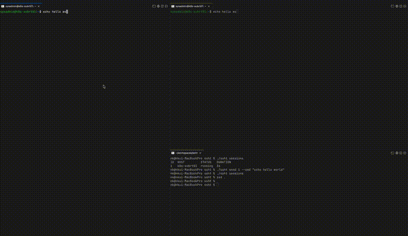
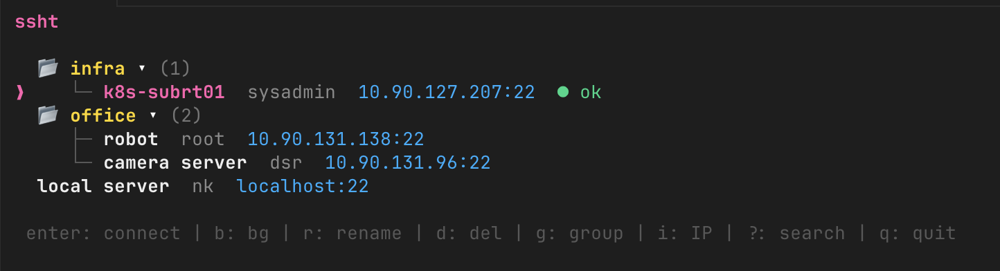
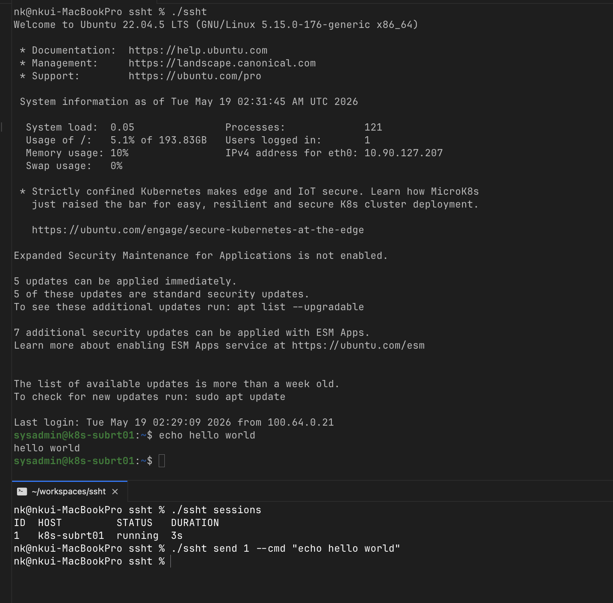
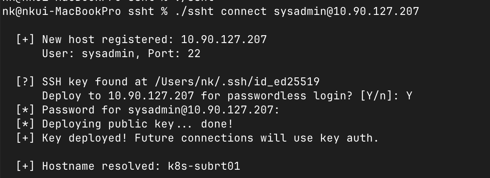

# ssht

[](https://opensource.org/licenses/MIT)
[](https://go.dev)

A free, open-source interactive SSH session manager built for developers and AI agents. Manage hosts, maintain persistent background sessions (like tmux), and control them programmatically with keystroke injection.



## Screenshots

| Interactive TUI | Session Control | Auto Registration |
|---|---|---|
|  |  |  |

## Features

- **Interactive TUI** — Tree-view host list with folders, search, inline connection testing
- **Auto Host Registration** — First connection auto-saves the host, resolves its hostname, and offers SSH key deployment
- **Background Sessions** — Persistent SSH connections that survive terminal close. Detach with `Ctrl+B d`, reattach from any terminal
- **Multi-Terminal Attach** — Multiple terminals can view and interact with the same session simultaneously
- **AI Keystroke Control** — Send commands, control sequences (`ctrl+c`, `ctrl+z`), and key sequences to background sessions via CLI
- **Output Reading** — Read terminal buffer or stream live output from background sessions
- **Multi-Server Execution** — Run commands across multiple hosts in parallel with formatted or JSON output
- **SSH Key Auto-Deploy** — Generates ed25519 keys and deploys them on first login (with password retry)
- **Encrypted Credentials** — Passwords stored with AES-256-GCM encryption using a machine-bound key
- **SSH Config Import** — Automatically imports hosts from `~/.ssh/config` (read-only)

## Install

```bash
go install github.com/chonamkyu/ssht@latest
```

Or build from source:

```bash
git clone https://github.com/chonamkyu/ssht.git
cd ssht
go build -o ssht .
```

**Requirements:** Go 1.21+, macOS or Linux

## Quick Start

```bash
# Launch interactive TUI
ssht

# Connect to a new host (auto-registers)
ssht connect user@10.0.1.5

# Connect in background
ssht connect myserver -b

# Attach to background session
ssht attach 1

# Send command to background session
ssht send 1 --cmd "deploy.sh"

# Read session output
ssht read 1
```

## Usage

### Interactive TUI

```bash
ssht
```

The default command launches an interactive terminal UI with a tree-view host list.

**Keybindings:**

| Key | Action |
|-----|--------|
| `enter` | New session (connect) |
| `c` | Attach to existing session |
| `b` | Start background session |
| `K` | Kill session |
| `r` | Rename host/group |
| `d` | Delete host |
| `g` | Move to group |
| `i` | Toggle IP display |
| `t` | Test connection |
| `?` | Search |
| `h/l` | Collapse/expand folder |
| `j/k` | Navigate up/down |
| `q` | Quit |

### Direct Connect

```bash
ssht connect user@hostname
ssht connect user@hostname:2222
ssht connect user@hostname -p "password"
ssht connect myserver -b              # background session
```

On first connection:
1. Host is automatically saved to your profile
2. Hostname is resolved from the remote server
3. SSH key deployment is offered for passwordless future logins

### Session Management

Background sessions persist after you disconnect, similar to tmux.

```bash
ssht sessions              # list active sessions
ssht attach <id>           # reattach to session
ssht sessions kill <id>    # kill a session
ssht sessions kill --all   # kill all sessions
```

- **Detach:** Press `Ctrl+B` then `d` to detach without closing the connection
- **Multi-attach:** Multiple terminals can attach to the same session simultaneously — all see the same output and can send input

### AI Keystroke Control

Designed for AI agents and automation. Send input to background sessions programmatically:

```bash
# Send a command (newline appended automatically)
ssht send <id> --cmd "ls -la"
ssht send <id> --cmd "kubectl get pods"

# Send control keys
ssht send <id> --key "ctrl+c"          # interrupt
ssht send <id> --key "ctrl+d"          # EOF
ssht send <id> --key "ctrl+z"          # suspend

# Send key sequences
ssht send <id> --key "up,up,enter"     # history navigation

# Read terminal output
ssht read <id>                          # last 50 lines
ssht read <id> --follow                 # stream live output

# Combined: send command and read output
ssht send <id> --cmd "echo hello" --output 10
```

**Supported keys:** `ctrl+a-z`, `enter`, `tab`, `escape`, `up`, `down`, `left`, `right`, `home`, `end`, `delete`, `pgup`, `pgdown`, `f1-f12`, `backspace`

**AI automation loop:**
```bash
# 1. Send command
ssht send 1 --cmd "make build"
# 2. Wait and read output
ssht read 1
# 3. If stuck, interrupt
ssht send 1 --key "ctrl+c"
# 4. Send next command
ssht send 1 --cmd "make test"
```

### Multi-Server Execution

Run commands across multiple hosts in parallel:

```bash
ssht exec "uptime" -h server1,server2
ssht exec "df -h" --tag prod
ssht exec "systemctl status nginx" --tag web
ssht exec "hostname" --tag all --json    # JSON output for scripting
```

### Host Management

```bash
ssht hosts                                              # list all hosts
ssht hosts add --name myserver --host 10.0.1.5 --user root
ssht hosts add --name db --host db.internal --user admin --port 2222
ssht hosts remove myserver
```

## Configuration

Config is stored at `~/.ssht/config.yaml`:

```yaml
hosts:
  - name: prod-web-1
    host: 10.0.1.10
    port: 22
    user: deploy
    key: ~/.ssh/id_ed25519
    group: production
    tags: [prod, web]
  - name: dev-db
    host: dev-db.internal
    port: 22
    user: root
    group: development
    tags: [dev, db]
```

- Hosts from `~/.ssh/config` are auto-imported (read-only, never modified)
- Passwords are AES-256-GCM encrypted with a machine-bound key at `~/.ssht/key`
- Groups organize hosts into collapsible folders in the TUI

## Architecture

```
ssht
├── cmd/              CLI commands (cobra)
│   ├── root.go       Root command, TUI launcher
│   ├── connect.go    Direct connect with auto-registration
│   ├── send.go       AI keystroke control
│   ├── read.go       Session output reading
│   ├── exec.go       Multi-server execution
│   ├── sessions.go   Session CRUD
│   └── hosts.go      Host management
├── internal/
│   ├── config/       Host profiles, YAML persistence, SSH config parser, AES encryption
│   ├── ssh/          SSH client, key generation, key deployment
│   ├── keys/         Keystroke parsing (ctrl sequences, special keys, key combos)
│   ├── session/      Background session daemon, unix socket IPC, ring buffer
│   ├── multi/        Parallel multi-host execution engine
│   └── tui/          Interactive terminal UI (bubbletea)
└── main.go
```

**Key design decisions:**
- Sessions run as daemon processes communicating via unix domain sockets
- Each session maintains a 64KB ring buffer for terminal output
- Multiple readers can attach to the same buffer independently (offset-tracked)
- The TUI exits cleanly before SSH shell starts to avoid stdin/stdout conflicts

## Cross-Platform

Supported platforms (built via `go build`):
- macOS (amd64, arm64)
- Linux (amd64, arm64)
- Windows (amd64) — limited: no unix socket session persistence

## License

This project is free and open-source software, licensed under the [MIT License](./LICENSE). You are free to use, modify, and distribute it without restriction.
